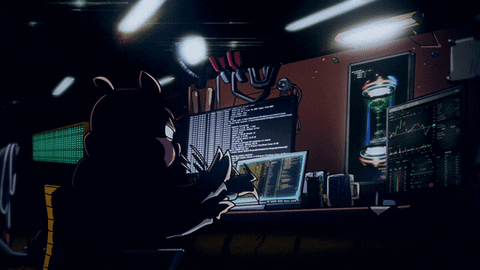

<h1 align="center">Hi there! &#128075; I'm Abdelaziz Omar</h1>

<h3 align="center">Back End Developer</h3>

## About Me

- Passionate about building backend services and practical API-driven systems.
- Reach me at: [abdelaziz.omar405@gmail.com](mailto:abdelaziz.omar405@gmail.com)
- Working mainly with Node.js, Express.js, PostgreSQL, MongoDB, MySQL, and Redis.
- I also worked with `.NET` and `C#`, backed by strong core programming fundamentals.

## Connect with me

  
  
  

 

## Technical Skills

  

  

## What I Do

- Build backend applications with clear structure and maintainable code.
- Design and develop RESTful APIs for web and mobile integrations.
- Work with SQL and NoSQL databases based on project needs.
- Implement authentication and authorization flows using JWT.
- Develop real-time features and communication flows with WebSockets.

## Current Direction

- Deepening backend architecture and system design knowledge.
- Strengthening practical experience with production-style applications.
- Continuing to grow in `.NET` while building on strong backend foundations.
